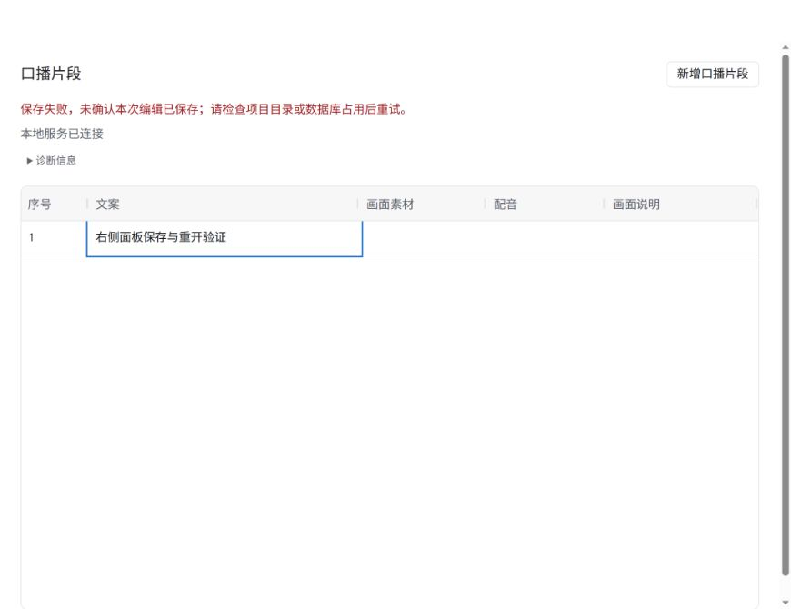

# #17 本地项目创建、保存与重开验证

日期：2026-09-27。环境：Linux、Node.js 22，Codex 右侧内置浏览器。

## 验收与证据

- 创建与重开：业务层测试创建临时空项目，关闭后重开，项目身份不变；服务固定绑定启动参数目录；实际运行启动器，用另一目录连接同一端口被明确拒绝，原项目保持不变。
- 稳定身份与顺序：业务层新增两个片段，修改第一段含换行文案，重开后身份、1/2 顺序及文案完全一致。
- 共享状态：MCP 协议测试经 HTTP 新增后，MCP 返回内容与 HTTP 已提交快照一致。
- 保存失败：HTTP 测试用真实 SQLite 写事务占用数据库，保存返回 500，重开保留原文；解除占用后再次编辑成功。
- 空项目与路径：空项目初始化即持久化；数据库、WAL、SHM、journal 与 media 符号链接均拒绝，项目外文件内容不变。HTTP 不开放数据库与任意文件。
- 右侧 UI：新增片段并输入「右侧面板保存与重开验证」，提交后显示「已保存」。再次编辑为「这次应保存失败」时用真实数据库锁注入失败，观察到「保存中…」再到「保存失败」，原文仍保留。刷新后恢复已保存原文。

类型检查、构建及全量测试（11/11）通过。构建保留现有 AG Grid 包体积提示。

## 范围

本事项仅实现文案及片段新增。素材、设置和任务尚未实现，后续使用同一业务事务机制；不声称它们已经恢复。未提交单元格输入不承诺恢复。三平台安装与任务生命周期仍由原后续事项承接。
