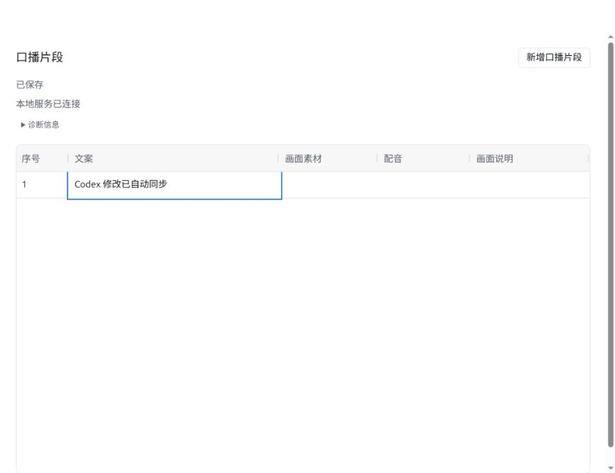
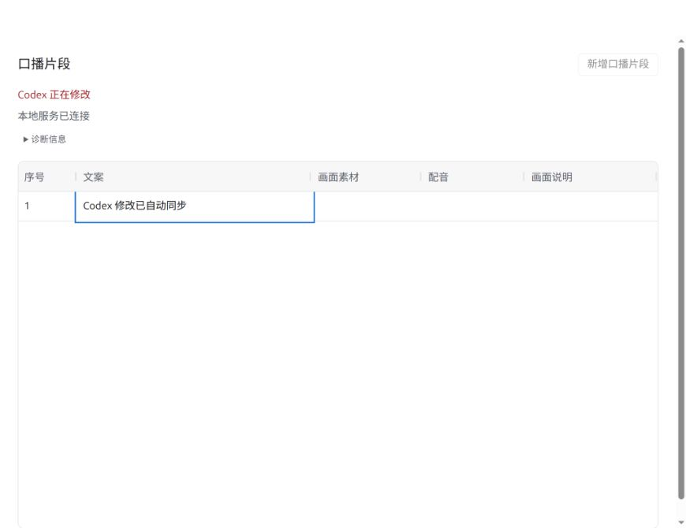

# #18 表格与 Codex 安全交替修改验证

日期：2026-09-27。环境：Linux、Node.js 22、Codex 右侧内置浏览器。

## 验收证据

- 用户修改权：HTTP 测试在编辑连接建立后调用 Codex 修改，立即返回 409；无凭据保存同样被拒绝。浏览器进入文案编辑后显示「用户正在编辑」，此时实际 Codex 写接口返回该原因。
- Codex 修改权：未完成的真实 HTTP 写请求持有修改权，查询仍成功，第二个写请求和用户申请编辑均返回 409；浏览器尝试 Enter 编辑时显示「Codex 正在修改」，没有打开输入框。
- 过时与删除目标：先查询三个片段，再修改第一个、删除第二个。使用旧快照提交批量修改，分别返回 changed（含最新文案）、deleted 和 applied；查询确认新文案未被覆盖、已删除片段未复活、第三项成功。
- 释放：覆盖正常保存、显式取消、用户连接中断、Codex 请求中断、无效请求和 SQLite 写事务占用。旧凭据的取消和保存不能影响后续编辑。普通修改权只按持有凭据释放，没有重置项目任务状态的入口；后台任务尚未实现，后续须保持独立生命周期。
- 同步：真实 MCP 协议修改及查询与 HTTP 状态一致。浏览器 Enter 保存文案、Esc 取消另一份输入后，MCP 查询仍为已保存内容；随后 MCP 修改为「Codex 修改已自动同步」，无需手动刷新即显示在表格。
- 异常无覆盖：SQLite 被占用时每项返回失败，已提交快照不变，修改权释放后可再次保存；失败项不冒充成功。

- 项目独占：审查发现不同端口双服务可能绕过内存修改权，已加入独立 SQLite 文件锁。新增测试先确认第二个服务拒绝打开同一项目，再确认原服务关闭后可重开；修复前失败、修复后通过。

## 执行结果

`npm run typecheck`、`npm run build`、`npm test`（17/17）通过。构建仍提示现有 AG Grid 包体积较大。

## 边界

本事项处理普通文案新增、编辑和删除。配音、导出及其持久任务锁不在本次实现范围。修改断线时可能已有部分目标完成，返回不确定结果时应查询项目，不自动重发。未提交的表格输入不承诺恢复。
