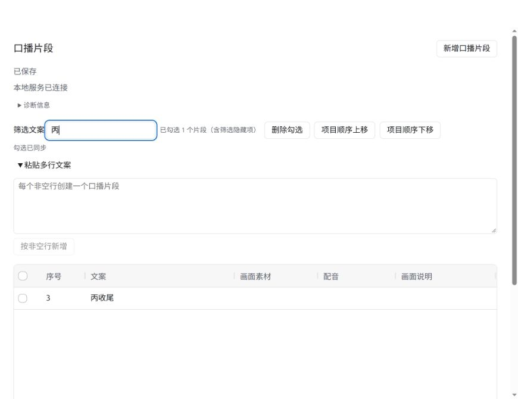
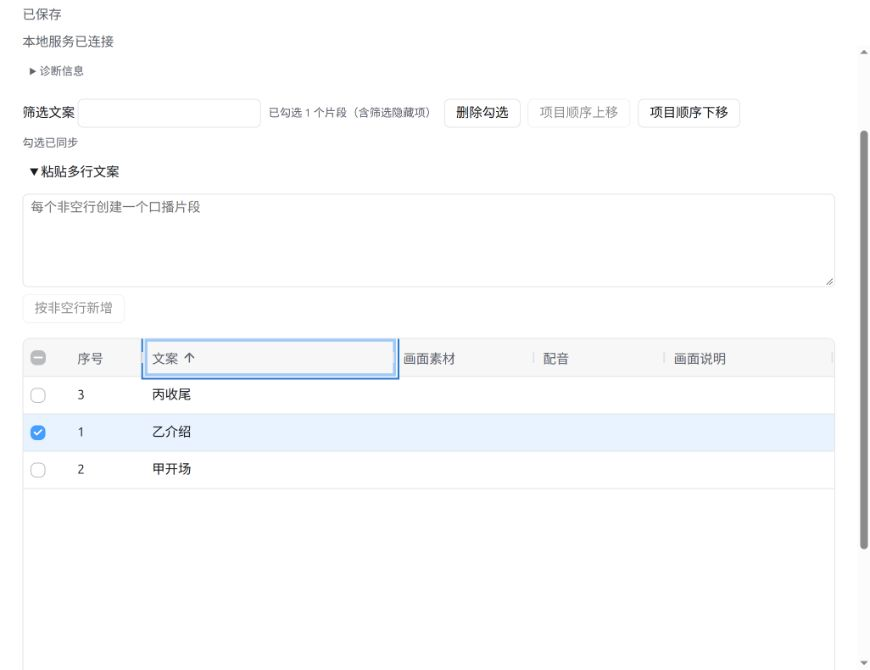
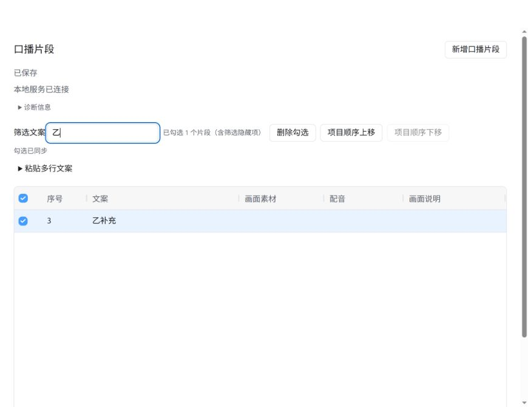

# #19 组织口播片段与明确范围验证

日期：2026-09-27。环境：Linux、Node.js 22.23.3、Codex 右侧内置浏览器。

## 自动化证据

- `tests/organization.test.ts`：含空行和 LF／CRLF／CR 的文案只创建非空行片段；原子重排保留身份，拒绝过时顺序和重复身份；已提交选中操作在改选和断开后仍只处理原始身份；空选择、断开和多表格歧义不扩大范围；明确身份和文案条件查询仍可用；删除后连续编号，批量删除不因自身序号变化漏处理。审查后补充：原条件目标变化／删除仍逐项反馈；501 个片段可以完整勾选并处理。
- `tests/modification.test.ts`：真实表格长连接不占用修改权；用户修改权下批量粘贴和重排成功，选择身份保持不变；断开后选中操作返回 409，明确身份删除仍成功。原有互斥、过时内容、已删除目标和存储失败测试继续通过。
- `tests/mcp.test.ts`：通过真实 MCP SDK 传输查询条件、当前勾选并按明确身份／选中范围修改；表格关闭后返回 unavailable，无可用选择的处理调用返回错误。
- 新增业务行为均先运行失败测试，再完成实现并运行通过。测试边界沿用 README 已确认约定，本次用户再次确认业务服务与 MCP 接口、浏览器表格验收。

## 浏览器证据

使用临时项目 `/tmp/clapgrid-issue19-validation`，没有操作用户生产项目。

1. 在「粘贴多行文案」输入含空行的甲开场、乙介绍、丙收尾，提交后只有三个片段。
2. 勾选乙介绍并筛选丙收尾，唯一可见行仍为项目序号 3，界面显示包含隐藏项的一个勾选；服务查询返回乙介绍的稳定身份。
3. 清除筛选并上移，乙介绍变为项目序号 1，身份和勾选保持不变。
4. 按文案表头进行视图排序，显示顺序变化而序号随片段保留；服务读取的项目顺序仍为乙介绍、甲开场、丙收尾。
5. 排序视图中编辑甲开场，Enter 保存后只有对应身份的文案改变。
6. 删除勾选，仅乙介绍被删除，甲开场和丙收尾保留。最终构建重开后分别显示连续序号 1、2；新增按钮创建序号 3 的空片段，编辑为乙补充并勾选、筛选后仍显示序号 3。
7. 关闭真实浏览器表格后，API 查询确认连接集合为空、选择为 unavailable；选中删除被拒绝，条件查询及明确身份修改仍成功。

## 执行结果与边界

审查前 `npm run typecheck`、`npm run build`、`npm test`（21/21）通过。按 open-code-review-delegate 完成只读审查，覆盖全部改动，发现并修复两项问题：范围查询过早过滤已变化／删除的目标，以及粘贴数量与选择上限不一致。两项新增测试均先失败后通过，复跑组织、互斥、MCP 三个测试文件（13/13），类型检查和构建通过；只读复核未发现新的实质问题。构建仍有现有 AG Grid 包体积提示。

选择属于临时表格连接，重连后从空选择开始；多个表格必须明确连接，不能合并选择。提交时复制范围，内容仍按共享业务规则重新读取核对；失败或断线不会自动重试。

本事项实现普通片段组织及范围解析，未实现配音或导出任务，后续任务须沿用固定目标契约。Windows、macOS 及完整插件安装验收仍由原有后续事项承接。
