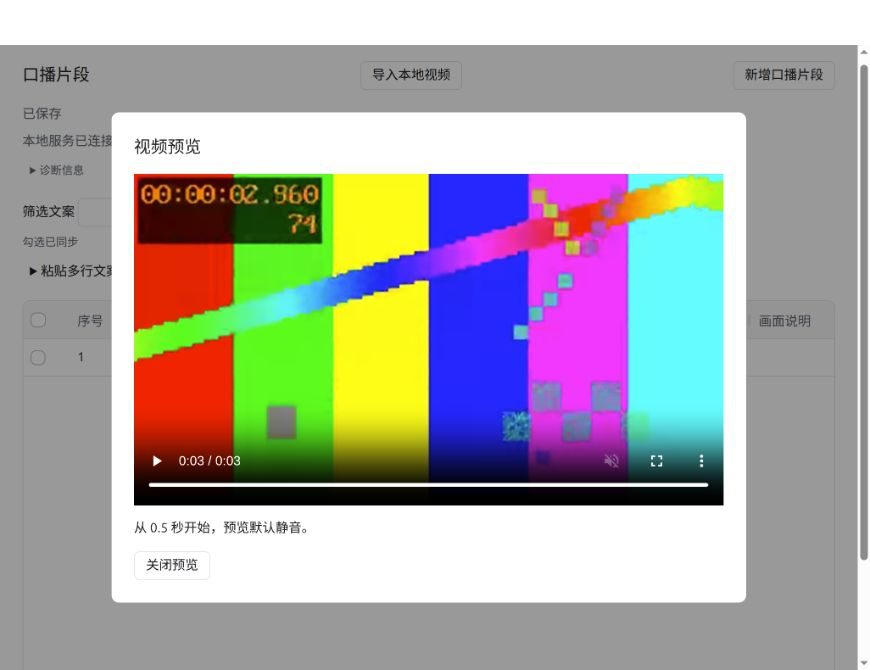
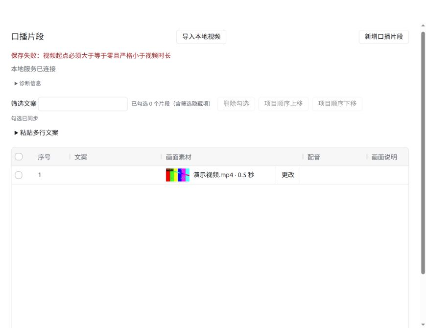

# #20 本地视频导入、复用与预览验证

日期：2026-09-27。环境：Ubuntu、Node.js 22.23.3、FFmpeg 6.1.1、Codex 右侧内置浏览器。测试边界经用户确认：业务服务、HTTP、MCP 和实际表格。

## 自动化证据

- `tests/video.test.ts` 使用真实 FFmpeg 生成视频，通过共享业务接口验证项目外来源复制、同素材用于两个片段、源文件被改写后仍可关联、重开后素材与起点一致。
- 覆盖不可解码来源／损坏项目副本、负数／NaN／Infinity／等于结尾／超出结尾的起点、旧快照关联、已删除目标、替换／解除／删除片段保留原有三个媒体文件。
- 独立构造 1 秒画面加 3 秒音轨，验证视频时长为 1 秒，1.5 秒起点被拒绝。
- 覆盖来源符号链接、目录、相对路径和播放列表拒绝；正在导入时反向竞争失败，释放修改权取消尚未提交的导入且不登记素材。
- `tests/video-service.test.ts` 通过真实 MCP SDK 与 HTTP 验证两端导入、关联、解除及共享快照，用户编辑期间 MCP 导入被拒绝；PNG 缩略图与 WebM 范围请求可用，任意身份和原件路由拒绝。
- 审查前 `npm test` 全量 29/29 通过；`npm run typecheck` 通过。测试先行的实现切片包括复制／复用／恢复、MCP／HTTP 接入、已删除目标和画面时长边界。

## 右侧表格证据

使用临时目录 `/tmp/clapgrid-issue20-validation`，不操作用户生产素材。

1. 表格「导入本地视频」输入明确的项目外测试视频绝对路径，完成复制与预览生成，状态返回「已保存」。
2. 新增片段，在「关联」中选择该素材，保存起点 `0.5`；画面素材列显示缩略图、文件名和起点。
3. 点击缩略图打开播放器，实际解码并播放完毕；读取 video DOM 得到 `duration=3`、`currentTime=3`、`readyState=4`、`videoWidth=640`，没有媒体错误。
4. 最终构建重启服务并刷新右侧表格，关联及 `0.5` 起点恢复。将项目外源文件移动后，再次打开播放器，仍得到 `duration=3`、`currentTime=3`、`readyState=4`，证明使用项目副本。
5. 将起点修改为结尾 `3`，服务拒绝并显示“视频起点必须大于等于零且严格小于视频时长”，表格仍显示原值 `0.5`。

## 验证边界

本事项不实现配音、导出或通用素材清理。预览静音不构成音频听感验收。Windows／macOS 安装、FFmpeg 首次组件分发与宿主插件加载仍由已有后续事项承接，不以本轮 Linux 开发验证替代。

## 只读审查与修复

按 open-code-review-delegate 执行 OCR preview/rule：可审查代码 8/8、覆盖率 100%；同时审查测试、文档及截图，覆盖全部 15 个改动条目。发现并修复两项 P2：

- 多轨视频的默认轨道可能使缩略图与预览不同。缩略图统一选择首视频轨道；新增红／蓝双轨真实视频测试，先失败后通过。
- 视频关联可能超过普通文本请求的 30 秒时限。表格关联改用独立可取消信号，媒体批处理取消固定总超时，仍保留服务端各媒体进程的 10 分钟上限和修改权取消机制。

修复后视频、HTTP／MCP 和普通修改权测试 14/14 通过，类型检查及构建通过。只读复核确认两项已解决，无新增问题；构建仍有现有 AG Grid 包体积提示。

另以真实 HTTP 关联操作加 31 秒延迟响应验证表格客户端：`modifyUserBatch` 携带可取消信号，在 `31213ms` 后返回 `applied=1`，未触发旧的 30 秒超时。
