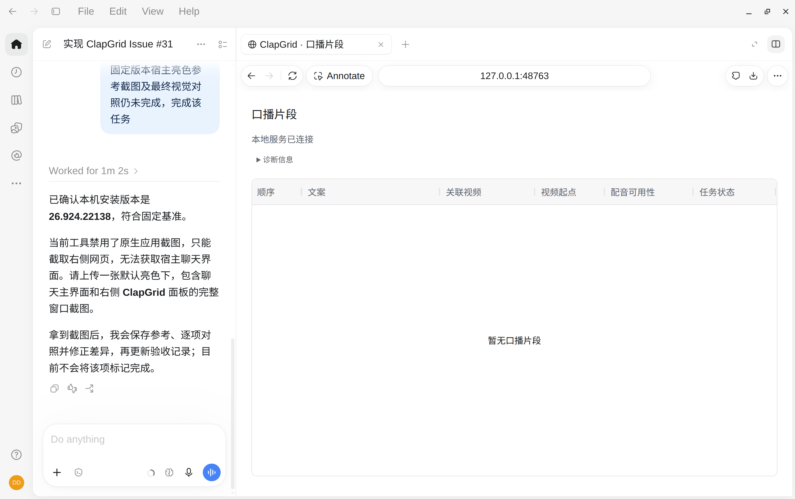

# #31 验证记录

## 范围与结论

使用 Codex 内嵌浏览器实际打开面板，独立服务项目 `/tmp/clapgrid-issue31-validation`，端口 48763。未向真实项目写入演示片段。

另用临时 HTTP 验证服务（48764）提供同一构建产物和符合状态协议的空片段快照，注入长路径、HTTP 500、延迟响应；不修改生产服务及业务数据。

已验证：

- 默认白色表面、深色正文、灰色表头，页面与 AG Grid 共享样式变量；工程占位说明消失。
- 连接成功且空项目显示“暂无口播片段”，技术诊断默认折叠。
- 通过键盘 Tab / Enter 展开诊断，焦点具有蓝色轮廓；长路径换行。
- 窄视口中 DOM 测量 `innerWidth=327`、页面 `scrollWidth=313`（滚动条占位），无页面横向溢出；表格内部滚动区域宽 280px、内容宽 810px。
- 从“顺序”表头按五次右箭头，焦点移动到“任务状态”并滚动到末列，六列均可访问。
- 宽视口 1440px 时页面宽度与滚动宽度均 1440px，六列宽度依次为 80 / 780 / 150 / 110 / 140 / 130px，文案列扩展。窄屏文案列为 200px。
- 初次请求延迟时页面与表格显示“正在连接本地服务…”；超过现有 3 秒请求超时进入失败状态。
- HTTP 500 显示错误提示及“暂时无法读取口播片段”，不误报为空项目。
- 临时视口覆盖已恢复。

截图：`connecting.png`、`error.png`、`diagnostics.png`、`narrow-diagnostics.png`、`narrow-last-column.png`、`connected.png`。

## 检查结果

- `npm run typecheck`：通过。
- `node --import tsx --test tests/service.test.ts`：2/2 通过。
- `npm run build`：通过；现有 AG Grid 主包触发 >500kB 体积提示。
- `npm test`：4/4 通过；Node SQLite 实验性提示，无失败。

本次是样式与原生折叠控件调整，没有新增业务逻辑单元测试；以上 UI 检查为会话内实际行为检查，不是持久自动化测试套件。

## 固定版本宿主与面板视觉对照（已完成）

用户在本次验收会话提供完整窗口原图，保存为 [codex-26.924.22138-host-panel.png](codex-26.924.22138-host-panel.png)。原图 2760 × 1736，未经裁切、缩放或重绘，左侧为宿主聊天主界面，右侧为 `127.0.0.1:48763` 的实际 ClapGrid 面板。已打开原图检查，两侧内容清晰、无加载遮挡，可在同一张截图内直接对照。

本机 `/usr/lib/chatgpt/resources/linux-package-metadata.json` 再次确认安装版本为 **26.924.22138**。版本依据来自安装元数据，截图本身不包含独立的“关于”版本窗口。此图作为本事项冻结的亮色视觉参考，不声称代表后续版本或所有用户的自定义主题。

原图 SHA-256：`62d56608dd539c7706e02df2d51e7d6c3d89a5e59486bcbfa6e0ede42e9c38fc`。

### 逐项对照

| 步骤 | 检查对象与截图位置 | 结果 |
| --- | --- | --- |
| 1 | 左侧聊天正文与右侧面板背景、主文字 | 通过。两侧均有纯白 #ffffff 主表面与 #1a1c1f 深色文字；对原图取色确认。没有原有绿色品牌色块。 |
| 2 | 右侧标题、连接状态、诊断入口及表头，对照左侧正文与辅助文字层级 | 通过。系统无衬线字体、深色标题与灰色辅助信息层级清晰。面板连接提示和表头取色为 #60646c。截图的显示缩放不能直接证明 CSS 字号；14px 正文与系统字体栈另由实现确认。 |
| 3 | 右侧表格外框、表头，与宿主分隔线和浅色控件 | 通过。细灰边框、浅灰填充、圆角外框保持一致的轻量视觉。表头取色 #f7f7f8、边框 #e3e4e7。表格不是宿主胶囊按钮，不要求两者圆角半径相等；未新增胶囊按钮或阴影卡片。 |
| 4 | 右侧标题至连接状态、诊断入口与表格之间的留白 | 通过。对齐统一左边线，分组间距清楚，没有挤压或横向溢出。4px 基础间距由样式变量定义，不能从带显示缩放的截图反推所有 CSS 距离。 |
| 5 | 实际右侧面板的业务布局 | 通过。六个列标题完整可见，文案列扩展；连接提示可见、诊断折叠、空态居中，工程占位已移除。 |

结论：在“参照宿主视觉语言、保留 ClapGrid 业务布局”的规格范围内，最终视觉对照通过，无需追加样式修改。未声称逐像素复制聊天布局。

### 证据边界与回归

- 此完整窗口图验证已连接空态和默认折叠状态；连接中、失败、展开、窄屏滚动及键盘焦点由前述实际交互检查及对应截图覆盖，不能从这一张静态图推断。
- 当前画面没有面板强调色控件，故不宣称已将 #339cff 与宿主语音按钮逐像素匹配；它仍是规格冻结的打包默认强调值。
- 截图不能证明屏幕阅读器行为或完整无障碍合规。本次没有新增此类合规声明。
- 补齐证据后重新运行 `npm run typecheck`、`npm run build`、`npm test`，均通过（4/4 测试）。本轮仅补充证据与记录，未修改运行时代码，构建与 SQLite 提示同上。

